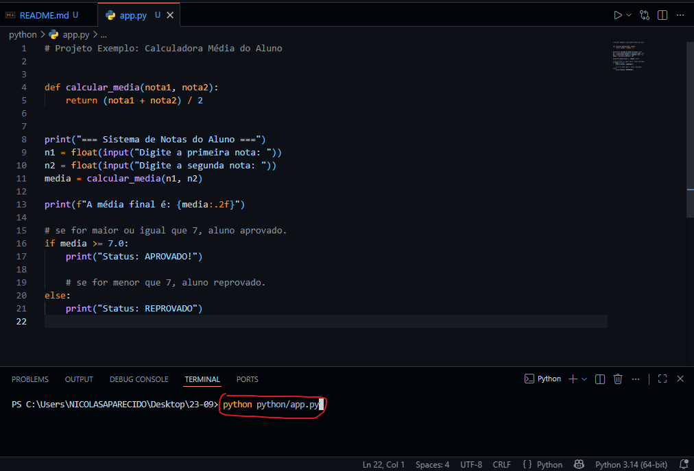
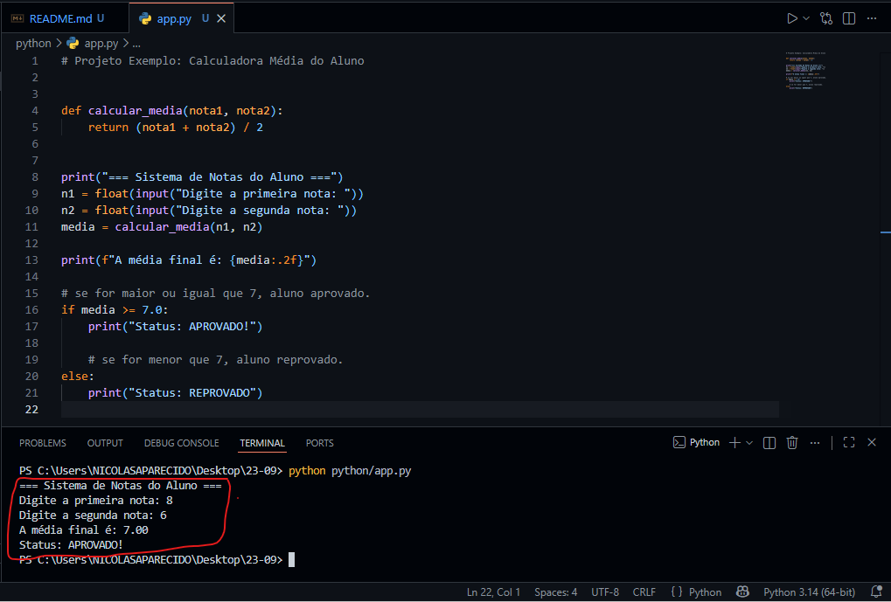

# Calculadora de Média.
## Calcular a média entre duas notas, e trazer retorno aprovado ou reprovado.

# Tecnologias Utilizadas:
       Python 3.14(64-bit)

# Como executar:
       Pode se usar uma IDE ou compliadores online.

### Comandos via terminal:
       python python/app.py
       py python/app.py

# Demonstração:
**Primeiro vamos escrever o código para executar:** 
       
       
**Depois vamos escrever o que o código pede, primeira nota e segunda nota, logo apos isso, o resultado será revelado:** 
       

# Autor:
       Nicolas Aparecido da Silva
       LinkedIn: www.linkedin.com/in/nicolas-aparecido-ti
       Email: nicolas.ti.info@gmail.com